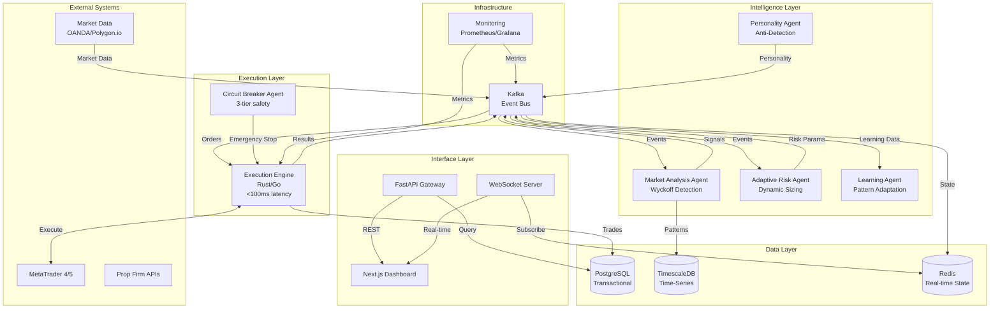
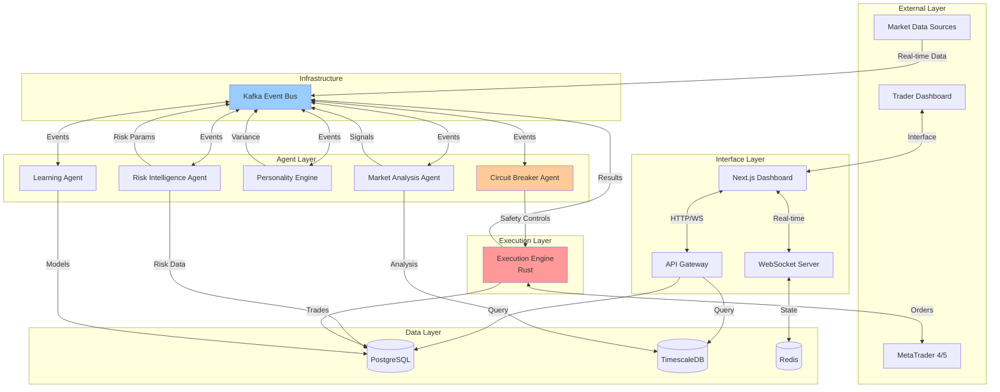
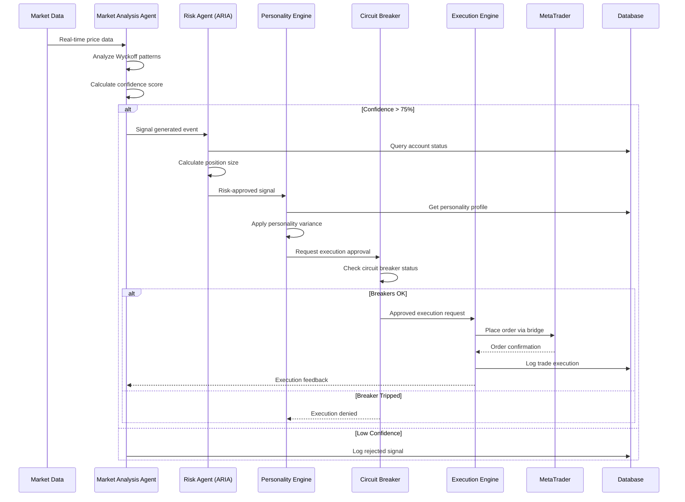
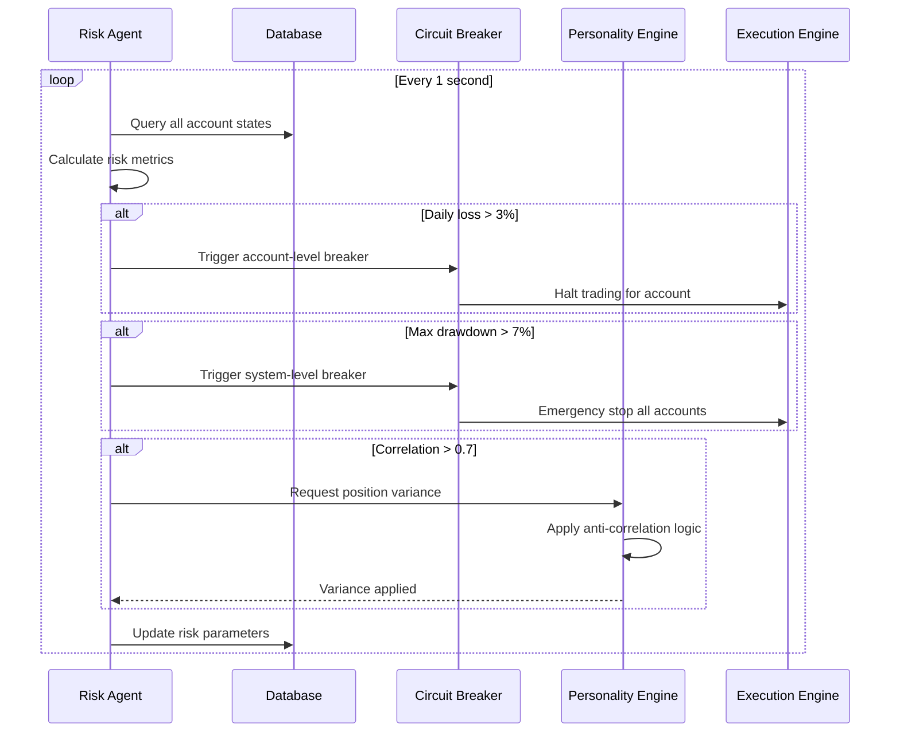

# Adaptive/Continuous Learning Autonomous Trading System Architecture Document

## Introduction

This document outlines the overall project architecture for **Adaptive/Continuous Learning Autonomous Trading System**, including backend systems, shared services, and non-UI specific concerns. Its primary goal is to serve as the guiding architectural blueprint for AI-driven development, ensuring consistency and adherence to chosen patterns and technologies.

**Relationship to Frontend Architecture:**
If the project includes a significant user interface, a separate Frontend Architecture Document will detail the frontend-specific design and MUST be used in conjunction with this document. Core technology stack choices documented herein (see "Tech Stack") are definitive for the entire project, including any frontend components.

### Starter Template or Existing Project

**Selected Approach:** Start from scratch with proven, stable tooling

Given your requirements for proven stability and no existing codebase, we'll build from scratch using well-established tools rather than experimental templates. This gives us full control while maintaining reliability.

### Change Log

| Date | Version | Description | Author |
|------|---------|-------------|--------|
| 2025-08-06 | 1.0 | Initial Architecture Document | Winston (Architect) |

## High Level Architecture

### Technical Summary

The system employs an **event-driven microservices architecture** utilizing eight specialized AI agents orchestrated through CrewAI, with Python/FastAPI services communicating via message queues. Core components include a high-performance Rust execution engine for sub-100ms trade execution, PostgreSQL/TimescaleDB for data persistence, and a Next.js dashboard for monitoring. The architecture prioritizes fault tolerance through service isolation, implements three-tier circuit breakers for risk management, and maintains complete audit trails. This design directly supports the PRD goals of 99.8% compliance rates and 70%+ profitable months through adaptive learning while preventing detection via personality-based execution variance.

### High Level Overview

1. **Architectural Style**: Event-Driven Microservices with Agent-Based Intelligence
   - Eight specialized agents operating as independent services
   - Asynchronous communication via Kafka for resilience
   - Circuit breaker patterns preventing cascade failures

2. **Repository Structure**: Monorepo (as specified in PRD)
   - Simplified dependency management
   - Atomic commits across services
   - Shared type definitions and utilities

3. **Service Architecture**: Microservices (as specified in PRD)
   - Each agent as isolated service
   - Execution engine as separate critical service
   - Dashboard as independent frontend service

4. **Primary Data Flow**:
   - Market data → Analysis agents → Signal generation → Risk validation → Execution → Monitoring
   - Continuous feedback loop from execution results to learning agents

5. **Key Architectural Decisions**:
   - **Python for AI agents**: Mature ML ecosystem, CrewAI compatibility
   - **Rust for execution**: Guaranteed low latency for critical path
   - **Kafka over NATS**: Better durability for financial transactions
   - **TimescaleDB**: Optimized for time-series market data

### High Level Project Diagram



### Architectural and Design Patterns

- **Event-Driven Architecture:** Using Kafka for asynchronous agent communication - *Rationale:* Ensures system resilience; if one agent fails, others continue operating
- **Microservices Pattern:** Each agent as independent service with own database connection - *Rationale:* Enables independent scaling and deployment of agents
- **Circuit Breaker Pattern:** Three-tier safety system (agent/account/system level) - *Rationale:* Critical for financial safety, prevents cascade failures during market anomalies
- **Repository Pattern:** Abstract data access for all persistence operations - *Rationale:* Enables testing with mock data and future database migrations
- **CQRS (Command Query Responsibility Segregation):** Separate read/write models for trading operations - *Rationale:* Optimizes high-frequency reads without impacting write performance
- **Saga Pattern:** Distributed transactions across agents for trade execution - *Rationale:* Maintains consistency across services without distributed locks
- **Observer Pattern:** Real-time dashboard updates via WebSocket subscriptions - *Rationale:* Provides instant feedback without polling overhead
- **Strategy Pattern:** Pluggable trading strategies within agents - *Rationale:* Allows runtime strategy selection based on market conditions
- **Anti-Corruption Layer:** Between external APIs and internal domain - *Rationale:* Protects system from external API changes and inconsistencies

## Tech Stack

### Cloud Infrastructure
- **Provider:** Google Cloud Platform
- **Key Services:** GKE (Kubernetes), Cloud SQL, Pub/Sub, Secret Manager
- **Deployment Regions:** us-central1 (primary), us-east1 (failover)

### Technology Stack Table

| Category | Technology | Version | Purpose | Rationale |
|----------|------------|---------|---------|-----------|
| **Language** | Python | 3.11.8 | AI agents, API services | Stable LTS, extensive ML ecosystem, CrewAI compatibility |
| **Language** | Rust | 1.75.0 | Execution engine | Guaranteed memory safety, <100ms latency requirements |
| **Language** | TypeScript | 5.3.3 | Frontend, shared types | Type safety, team productivity, ecosystem maturity |
| **Runtime** | Node.js | 20.11.0 | Dashboard backend | LTS version, proven stability, extensive ecosystem |
| **AI Framework** | CrewAI | 0.28.8 | Agent orchestration | Multi-agent coordination, as specified in PRD |
| **Backend Framework** | FastAPI | 0.109.1 | Python API services | High performance, automatic docs, async support |
| **Frontend Framework** | Next.js | 14.1.0 | Trading dashboard | Server-side rendering, excellent DX, proven at scale |
| **Database** | PostgreSQL | 15.6 | Transactional data | ACID compliance, proven reliability for financial data |
| **Time-Series DB** | TimescaleDB | 2.14.2 | Market data storage | PostgreSQL extension, optimized for time-series |
| **Cache/State** | Redis | 7.2.4 | Real-time state, sessions | Sub-millisecond latency, battle-tested |
| **Message Queue** | Apache Kafka | 3.6.1 | Event streaming | Durability guarantees, exactly-once semantics |
| **Monitoring** | Prometheus | 2.49.1 | Metrics collection | Industry standard, extensive ecosystem |
| **Visualization** | Grafana | 10.3.3 | Dashboards, alerting | Proven monitoring solution |
| **Secrets** | HashiCorp Vault | 1.15.6 | Secrets management | Enterprise-grade security, as specified in PRD |
| **Container** | Docker | 25.0.3 | Application packaging | Industry standard, proven stability |
| **Orchestration** | Kubernetes | 1.29.1 | Container orchestration | Battle-tested, Google Cloud native |
| **Testing** | pytest | 8.0.1 | Python testing | Most mature Python testing framework |
| **Testing** | Jest | 29.7.0 | JavaScript testing | React/Next.js standard, extensive mocking |
| **Linting** | Black | 24.2.0 | Python formatting | Deterministic, zero-config |
| **Linting** | ESLint | 8.56.0 | TypeScript/JS linting | Industry standard, extensive rules |

## Data Models

### Trading Account

**Purpose:** Represents a prop firm trading account with its configuration, credentials, and current state

**Key Attributes:**
- account_id: UUID - Unique system identifier
- prop_firm: String - Firm name (FTMO, MyForexFunds, etc.)
- account_number: String - External account identifier  
- legal_entity_id: UUID - Associated legal entity for compliance
- status: Enum - active, suspended, in_drawdown, terminated
- balance: Decimal - Current account balance
- equity: Decimal - Current equity including floating P&L
- max_daily_loss: Decimal - Daily loss limit from prop firm rules
- max_total_loss: Decimal - Maximum drawdown limit
- current_daily_pnl: Decimal - Today's profit/loss
- max_drawdown_reached: Decimal - Historical maximum drawdown
- personality_profile_id: UUID - Associated trading personality
- created_at: DateTime - Account creation timestamp
- updated_at: DateTime - Last modification timestamp

**Relationships:**
- Has many Positions (one-to-many)
- Has many Trade executions (one-to-many) 
- Belongs to one LegalEntity (many-to-one)
- Has one PersonalityProfile (one-to-one)

### Position

**Purpose:** Represents an active or closed trading position with all associated metadata

**Key Attributes:**
- position_id: UUID - Unique position identifier
- account_id: UUID - Associated trading account
- symbol: String - Trading pair (EURUSD, GBPUSD, etc.)
- position_type: Enum - long, short
- volume: Decimal - Position size in lots
- entry_price: Decimal - Position entry price
- current_price: Decimal - Current market price
- stop_loss: Decimal - Stop loss level
- take_profit: Decimal - Take profit level
- unrealized_pnl: Decimal - Current floating profit/loss
- realized_pnl: Decimal - Realized profit/loss when closed
- status: Enum - open, closed, partial
- entry_time: DateTime - Position open timestamp
- exit_time: DateTime - Position close timestamp (if closed)
- wyckoff_phase: String - Market phase when entered
- confidence_score: Float - Signal confidence (0-100)
- risk_reward_ratio: Float - Expected risk/reward ratio

**Relationships:**
- Belongs to one TradingAccount (many-to-one)
- Has many TradeExecutions (one-to-many)
- Generated by one TradingSignal (many-to-one)

### Trading Signal

**Purpose:** Represents a generated trading opportunity with analysis metadata

**Key Attributes:**
- signal_id: UUID - Unique signal identifier  
- symbol: String - Trading pair
- signal_type: Enum - buy, sell
- confidence_score: Float - Signal strength (0-100)
- entry_price: Decimal - Recommended entry price
- stop_loss: Decimal - Recommended stop loss
- take_profit: Decimal - Recommended take profit
- risk_reward_ratio: Float - Calculated risk/reward
- wyckoff_phase: String - Detected market phase
- pattern_type: String - Pattern that triggered signal
- volume_confirmation: Boolean - Volume confirms pattern
- timeframe: String - Analysis timeframe (M5, H1, H4)
- generated_at: DateTime - Signal creation time
- expires_at: DateTime - Signal expiration time
- status: Enum - active, executed, expired, rejected

**Relationships:**
- Can generate multiple Positions (one-to-many)
- Created by MarketAnalysisAgent

### Agent State

**Purpose:** Tracks the current state and configuration of each AI agent

**Key Attributes:**
- agent_id: UUID - Unique agent identifier
- agent_type: Enum - market_analysis, risk_management, execution, etc.
- status: Enum - active, inactive, error, maintenance
- configuration: JSONB - Agent-specific parameters
- performance_metrics: JSONB - Success rates, response times
- last_heartbeat: DateTime - Health check timestamp
- error_count: Integer - Recent error count
- version: String - Agent version/model version
- learning_enabled: Boolean - Whether agent can adapt
- circuit_breaker_status: Enum - normal, warning, tripped

**Relationships:**
- Generates TradingSignals (one-to-many)
- Has many AgentDecisions (one-to-many)

### Personality Profile  

**Purpose:** Defines unique trading personality characteristics for anti-detection

**Key Attributes:**
- personality_id: UUID - Unique identifier
- name: String - Personality name/identifier
- risk_appetite: Float - Risk tolerance (0.5-2.0%)
- preferred_pairs: JSON Array - Favorite trading pairs
- trading_sessions: JSON Array - Preferred trading times
- aggression_level: Float - Trading aggressiveness (0-1)
- patience_score: Float - Willingness to wait for setups (0-1)
- favorite_timeframes: JSON Array - Preferred analysis timeframes
- position_hold_preference: String - scalper, day_trader, swing_trader
- variance_tolerance: Float - Acceptable execution variance
- created_at: DateTime - Profile creation time

**Relationships:**
- Used by one TradingAccount (one-to-one)
- Influences multiple TradeExecutions

## Components

### Market Analysis Agent

**Responsibility:** Performs Wyckoff pattern detection, volume price analysis, and generates high-confidence trading signals

**Key Interfaces:**
- `/api/v1/signals/generate` - POST endpoint for signal generation
- `market.analysis.pattern_detected` - Kafka event when pattern found
- `market.analysis.signal_generated` - Kafka event for new signals
- WebSocket `/ws/analysis` - Real-time pattern updates

**Dependencies:** 
- TimescaleDB for historical market data
- Redis for real-time price streams
- Kafka for event publishing

**Technology Stack:** Python 3.11 + FastAPI + CrewAI + pandas/numpy for analysis

### Adaptive Risk Intelligence Agent (ARIA)

**Responsibility:** Dynamic position sizing, risk parameter adjustment based on account performance, volatility, and market conditions

**Key Interfaces:**
- `/api/v1/risk/calculate-position-size` - POST for position sizing
- `/api/v1/risk/update-parameters` - PUT for parameter updates  
- `risk.management.size_calculated` - Kafka event with position size
- `risk.management.parameters_updated` - Kafka event for risk changes

**Dependencies:**
- PostgreSQL for account and position data
- Redis for real-time account states
- Market Analysis Agent for volatility data

**Technology Stack:** Python 3.11 + FastAPI + CrewAI + scipy for statistical calculations

### Execution Engine

**Responsibility:** High-speed trade execution, MT4/MT5 bridge, order management, and sub-100ms latency requirements

**Key Interfaces:**
- `/api/v1/execution/place-order` - POST for order placement
- `/api/v1/execution/modify-order` - PUT for SL/TP modifications
- `execution.order.placed` - Kafka event when order executed
- `execution.order.filled` - Kafka event when order completed

**Dependencies:**
- MetaTrader 4/5 APIs via bridge
- Redis for order state caching
- Circuit Breaker Agent for safety controls

**Technology Stack:** Rust 1.75 + tokio async runtime + custom MT4/5 bridge

### Circuit Breaker Agent

**Responsibility:** Three-tier safety system (agent/account/system level), emergency stops, and risk limit enforcement

**Key Interfaces:**
- `/api/v1/breaker/status` - GET current breaker states
- `/api/v1/breaker/trigger` - POST emergency stop activation
- `breaker.agent.triggered` - Kafka event for agent-level stops
- `breaker.system.emergency` - Kafka event for system-wide halt

**Dependencies:**
- All other agents (monitors their health)
- Execution Engine (can halt trading)
- Redis for real-time state tracking

**Technology Stack:** Python 3.11 + FastAPI + asyncio for concurrent monitoring

### Personality Engine

**Responsibility:** Anti-detection through unique trading personalities, execution variance, and correlation masking

**Key Interfaces:**
- `/api/v1/personality/get-profile/{account_id}` - GET personality data
- `/api/v1/personality/apply-variance` - POST for execution variance
- `personality.variance.applied` - Kafka event with timing adjustments
- `personality.decision.override` - Kafka event for disagreements

**Dependencies:**
- Trading Account data for personality assignments
- Execution Engine for variance application
- Anti-Correlation monitoring system

**Technology Stack:** Python 3.11 + FastAPI + CrewAI + random/statistical libraries

### Learning Agent

**Responsibility:** Pattern adaptation, performance tracking, learning circuit breakers, and strategy optimization

**Key Interfaces:**
- `/api/v1/learning/update-model` - POST for model updates
- `/api/v1/learning/performance-metrics` - GET learning statistics
- `learning.model.updated` - Kafka event when model changes
- `learning.breaker.triggered` - Kafka event when learning halted

**Dependencies:**
- All trade execution data for learning
- Market Analysis Agent for pattern feedback
- Circuit Breaker for learning safety

**Technology Stack:** Python 3.11 + FastAPI + CrewAI + scikit-learn/tensorflow

### Dashboard API Gateway

**Responsibility:** Authentication, API routing, rate limiting, and WebSocket coordination for the trading dashboard

**Key Interfaces:**
- `/api/v1/auth/login` - POST authentication with 2FA
- `/api/v1/accounts` - GET/PUT account management
- `/api/v1/positions` - GET real-time position data
- WebSocket `/ws/dashboard` - Real-time updates aggregation

**Dependencies:**
- PostgreSQL for user and account data
- Redis for session management
- All agent APIs for data aggregation

**Technology Stack:** Python 3.11 + FastAPI + JWT authentication + WebSockets

### Next.js Dashboard Frontend

**Responsibility:** Web-based trading command center, multi-account monitoring, manual controls, and responsive interface

**Key Interfaces:**
- Dashboard API Gateway (REST + WebSocket client)
- Real-time chart rendering
- Emergency stop controls UI
- Account configuration interface

**Dependencies:**
- Dashboard API Gateway for all data
- WebSocket connection for real-time updates

**Technology Stack:** Next.js 14.1 + TypeScript 5.3 + TailwindCSS + React Query

### Component Diagrams



## External APIs

### OANDA API

- **Purpose:** Real-time forex market data and historical price feeds for major currency pairs (EUR/USD, GBP/USD, USD/JPY)
- **Documentation:** https://developer.oanda.com/rest-live-v20/introduction/
- **Base URL(s):** 
  - Live: `https://api-fxtrade.oanda.com`
  - Demo: `https://api-fxpractice.oanda.com`
- **Authentication:** Bearer token authentication with API key
- **Rate Limits:** 120 requests/minute for REST, unlimited WebSocket connections

**Key Endpoints Used:**
- `GET /v3/instruments/{instrument}/candles` - Historical OHLCV data
- `GET /v3/pricing/stream` - Real-time price streaming
- `GET /v3/accounts/{accountID}/pricing` - Current market prices
- `GET /v3/instruments` - Available trading instruments

**Integration Notes:** Primary data source for forex analysis. WebSocket connection required for sub-second price updates. Handle reconnection logic for stream interruptions.

### Polygon.io API

- **Purpose:** Real-time and historical market data for major indices (US30, NAS100, SPX500) and supplementary forex data
- **Documentation:** https://polygon.io/docs/
- **Base URL(s):** `https://api.polygon.io`
- **Authentication:** API key via query parameter or header
- **Rate Limits:** 5 calls/minute (basic), 1000 calls/minute (professional)

**Key Endpoints Used:**
- `GET /v2/aggs/ticker/{ticker}/range/{multiplier}/{timespan}/{from}/{to}` - Historical aggregates
- `WebSocket wss://socket.polygon.io/` - Real-time market data
- `GET /v3/reference/tickers` - Available symbols and metadata
- `GET /v2/last/trade/{ticker}` - Latest trade information

**Integration Notes:** Backup data source and primary for indices. WebSocket requires subscription management. Implement fallback to OANDA for forex if Polygon fails.

### MetaTrader 4/5 Bridge APIs

- **Purpose:** Direct trade execution on prop firm accounts, position management, account synchronization
- **Documentation:** Custom bridge implementation required (no standard API)
- **Base URL(s):** Local bridge service endpoints (bridge runs on same VPS as MT4/5)
- **Authentication:** Account credentials + bridge authentication token
- **Rate Limits:** Platform dependent, typically 10-20 orders/second maximum

**Key Endpoints Used:**
- `POST /bridge/order/market` - Place market orders
- `POST /bridge/order/pending` - Place pending orders
- `PUT /bridge/order/modify` - Modify stop loss/take profit
- `GET /bridge/account/info` - Account balance and equity
- `GET /bridge/positions` - Current open positions
- `WebSocket /bridge/events` - Real-time order events

**Integration Notes:** Most critical integration for execution. Requires custom bridge development. Implement connection monitoring with auto-reconnect. Handle order rejections and partial fills gracefully.

### Economic Calendar API (Trading Economics)

- **Purpose:** News event filtering for trading restrictions during high-impact announcements
- **Documentation:** https://docs.tradingeconomics.com/
- **Base URL(s):** `https://api.tradingeconomics.com`
- **Authentication:** API key via query parameter
- **Rate Limits:** 500 requests/month (free tier)

**Key Endpoints Used:**
- `GET /calendar` - Economic events calendar
- `GET /calendar/country/{country}` - Country-specific events
- `GET /calendar/indicator/{indicator}` - Specific indicator data

**Integration Notes:** Used by risk management for news trading restrictions. Cache events daily to minimize API calls. Filter for high-impact events affecting traded currencies.

### HashiCorp Vault API

- **Purpose:** Secure storage and rotation of API keys, broker credentials, and sensitive configuration
- **Documentation:** https://developer.hashicorp.com/vault/api-docs
- **Base URL(s):** Self-hosted Vault instance
- **Authentication:** Vault token or Kubernetes service account
- **Rate Limits:** No enforced limits (self-hosted)

**Key Endpoints Used:**
- `GET /v1/secret/data/{path}` - Retrieve secrets
- `POST /v1/secret/data/{path}` - Store secrets
- `POST /v1/auth/kubernetes/login` - Kubernetes authentication
- `GET /v1/sys/health` - Health check

**Integration Notes:** Critical for security compliance. All external API credentials stored here. Implement automatic token renewal. Use Kubernetes service accounts for pod authentication.

## Core Workflows

### Signal Generation and Trade Execution Workflow



### Multi-Account Risk Management Workflow



## REST API Spec

```yaml
openapi: 3.0.0
info:
  title: Adaptive Trading System API
  version: 1.0.0
  description: REST API for the autonomous trading system supporting multi-agent coordination, account management, and real-time trading operations
servers:
  - url: https://api.trading-system.com/v1
    description: Production API server
  - url: https://staging-api.trading-system.com/v1
    description: Staging API server

security:
  - BearerAuth: []

paths:
  # Authentication endpoints
  /auth/login:
    post:
      summary: Authenticate user with 2FA
      tags: [Authentication]
      security: []
      requestBody:
        required: true
        content:
          application/json:
            schema:
              type: object
              required: [username, password, totp_code]
              properties:
                username:
                  type: string
                password:
                  type: string
                totp_code:
                  type: string
                  description: Time-based one-time password
      responses:
        '200':
          description: Login successful
          content:
            application/json:
              schema:
                type: object
                properties:
                  access_token:
                    type: string
                  refresh_token:
                    type: string
                  expires_in:
                    type: integer

  # Account management
  /accounts:
    get:
      summary: List all trading accounts
      tags: [Accounts]
      responses:
        '200':
          description: List of trading accounts
          content:
            application/json:
              schema:
                type: array
                items:
                  $ref: '#/components/schemas/TradingAccount'
    
    post:
      summary: Create new trading account
      tags: [Accounts]
      requestBody:
        required: true
        content:
          application/json:
            schema:
              $ref: '#/components/schemas/CreateAccountRequest'
      responses:
        '201':
          description: Account created successfully
          content:
            application/json:
              schema:
                $ref: '#/components/schemas/TradingAccount'

  /accounts/{account_id}:
    get:
      summary: Get specific account details
      tags: [Accounts]
      parameters:
        - name: account_id
          in: path
          required: true
          schema:
            type: string
            format: uuid
      responses:
        '200':
          description: Account details
          content:
            application/json:
              schema:
                $ref: '#/components/schemas/TradingAccount'

  # Position management  
  /accounts/{account_id}/positions:
    get:
      summary: Get account positions
      tags: [Positions]
      parameters:
        - name: account_id
          in: path
          required: true
          schema:
            type: string
            format: uuid
        - name: status
          in: query
          schema:
            type: string
            enum: [open, closed, partial]
      responses:
        '200':
          description: List of positions
          content:
            application/json:
              schema:
                type: array
                items:
                  $ref: '#/components/schemas/Position'

  # Circuit breaker controls
  /breaker/status:
    get:
      summary: Get circuit breaker status
      tags: [Circuit Breaker]
      responses:
        '200':
          description: Breaker status for all levels
          content:
            application/json:
              schema:
                type: object
                properties:
                  system_level:
                    $ref: '#/components/schemas/BreakerStatus'
                  account_level:
                    type: array
                    items:
                      type: object
                      properties:
                        account_id:
                          type: string
                          format: uuid
                        status:
                          $ref: '#/components/schemas/BreakerStatus'

components:
  securitySchemes:
    BearerAuth:
      type: http
      scheme: bearer
      bearerFormat: JWT

  schemas:
    TradingAccount:
      type: object
      properties:
        account_id:
          type: string
          format: uuid
        prop_firm:
          type: string
          enum: [FTMO, MyForexFunds, FundedNext]
        account_number:
          type: string
        status:
          type: string
          enum: [active, suspended, in_drawdown, terminated]
        balance:
          type: number
          format: decimal
        equity:
          type: number
          format: decimal

    Position:
      type: object
      properties:
        position_id:
          type: string
          format: uuid
        account_id:
          type: string
          format: uuid
        symbol:
          type: string
        position_type:
          type: string
          enum: [long, short]
        volume:
          type: number
          format: decimal

    BreakerStatus:
      type: object
      properties:
        status:
          type: string
          enum: [normal, warning, tripped]
        triggered_at:
          type: string
          format: date-time
          nullable: true
        reason:
          type: string
          nullable: true
```

## Database Schema

### PostgreSQL Schema (Transactional Data)

```sql
-- Extensions
CREATE EXTENSION IF NOT EXISTS "uuid-ossp";
CREATE EXTENSION IF NOT EXISTS "timescaledb";

-- Legal entities table for compliance
CREATE TABLE legal_entities (
    entity_id UUID PRIMARY KEY DEFAULT uuid_generate_v4(),
    entity_name VARCHAR(255) NOT NULL,
    jurisdiction VARCHAR(100) NOT NULL,
    registration_number VARCHAR(100),
    created_at TIMESTAMP WITH TIME ZONE DEFAULT NOW(),
    updated_at TIMESTAMP WITH TIME ZONE DEFAULT NOW()
);

-- Personality profiles for anti-detection
CREATE TABLE personality_profiles (
    personality_id UUID PRIMARY KEY DEFAULT uuid_generate_v4(),
    name VARCHAR(100) NOT NULL,
    risk_appetite DECIMAL(3,2) NOT NULL CHECK (risk_appetite BETWEEN 0.5 AND 2.0),
    preferred_pairs JSONB NOT NULL DEFAULT '[]'::jsonb,
    trading_sessions JSONB NOT NULL DEFAULT '[]'::jsonb,
    aggression_level DECIMAL(3,2) NOT NULL CHECK (aggression_level BETWEEN 0.0 AND 1.0),
    patience_score DECIMAL(3,2) NOT NULL CHECK (patience_score BETWEEN 0.0 AND 1.0),
    favorite_timeframes JSONB NOT NULL DEFAULT '[]'::jsonb,
    position_hold_preference VARCHAR(20) CHECK (position_hold_preference IN ('scalper', 'day_trader', 'swing_trader')),
    variance_tolerance DECIMAL(3,2) NOT NULL DEFAULT 0.1,
    created_at TIMESTAMP WITH TIME ZONE DEFAULT NOW(),
    updated_at TIMESTAMP WITH TIME ZONE DEFAULT NOW()
);

-- Trading accounts
CREATE TABLE trading_accounts (
    account_id UUID PRIMARY KEY DEFAULT uuid_generate_v4(),
    prop_firm VARCHAR(50) NOT NULL CHECK (prop_firm IN ('FTMO', 'MyForexFunds', 'FundedNext')),
    account_number VARCHAR(100) NOT NULL,
    legal_entity_id UUID NOT NULL REFERENCES legal_entities(entity_id),
    personality_profile_id UUID REFERENCES personality_profiles(personality_id),
    status VARCHAR(20) NOT NULL DEFAULT 'active' CHECK (status IN ('active', 'suspended', 'in_drawdown', 'terminated')),
    balance DECIMAL(12,2) NOT NULL DEFAULT 0.00,
    equity DECIMAL(12,2) NOT NULL DEFAULT 0.00,
    max_daily_loss DECIMAL(12,2) NOT NULL,
    max_total_loss DECIMAL(12,2) NOT NULL,
    current_daily_pnl DECIMAL(12,2) NOT NULL DEFAULT 0.00,
    max_drawdown_reached DECIMAL(12,2) NOT NULL DEFAULT 0.00,
    encrypted_credentials TEXT, -- Encrypted broker credentials
    created_at TIMESTAMP WITH TIME ZONE DEFAULT NOW(),
    updated_at TIMESTAMP WITH TIME ZONE DEFAULT NOW(),
    
    UNIQUE(prop_firm, account_number)
);

-- Trading signals
CREATE TABLE trading_signals (
    signal_id UUID PRIMARY KEY DEFAULT uuid_generate_v4(),
    symbol VARCHAR(20) NOT NULL,
    signal_type VARCHAR(10) NOT NULL CHECK (signal_type IN ('buy', 'sell')),
    confidence_score DECIMAL(5,2) NOT NULL CHECK (confidence_score BETWEEN 0.00 AND 100.00),
    entry_price DECIMAL(10,5) NOT NULL,
    stop_loss DECIMAL(10,5) NOT NULL,
    take_profit DECIMAL(10,5) NOT NULL,
    risk_reward_ratio DECIMAL(4,2) NOT NULL,
    wyckoff_phase VARCHAR(50),
    pattern_type VARCHAR(100),
    volume_confirmation BOOLEAN NOT NULL DEFAULT false,
    timeframe VARCHAR(10) NOT NULL,
    generated_at TIMESTAMP WITH TIME ZONE DEFAULT NOW(),
    expires_at TIMESTAMP WITH TIME ZONE NOT NULL,
    status VARCHAR(20) NOT NULL DEFAULT 'active' CHECK (status IN ('active', 'executed', 'expired', 'rejected')),
    created_by_agent VARCHAR(50) NOT NULL
);

-- Positions
CREATE TABLE positions (
    position_id UUID PRIMARY KEY DEFAULT uuid_generate_v4(),
    account_id UUID NOT NULL REFERENCES trading_accounts(account_id),
    signal_id UUID REFERENCES trading_signals(signal_id),
    symbol VARCHAR(20) NOT NULL,
    position_type VARCHAR(10) NOT NULL CHECK (position_type IN ('long', 'short')),
    volume DECIMAL(10,2) NOT NULL,
    entry_price DECIMAL(10,5) NOT NULL,
    current_price DECIMAL(10,5),
    stop_loss DECIMAL(10,5) NOT NULL,
    take_profit DECIMAL(10,5) NOT NULL,
    unrealized_pnl DECIMAL(12,2) DEFAULT 0.00,
    realized_pnl DECIMAL(12,2) DEFAULT 0.00,
    status VARCHAR(20) NOT NULL DEFAULT 'open' CHECK (status IN ('open', 'closed', 'partial')),
    entry_time TIMESTAMP WITH TIME ZONE DEFAULT NOW(),
    exit_time TIMESTAMP WITH TIME ZONE,
    wyckoff_phase VARCHAR(50),
    confidence_score DECIMAL(5,2),
    risk_reward_ratio DECIMAL(4,2)
);

-- Agent states for monitoring
CREATE TABLE agent_states (
    agent_id UUID PRIMARY KEY DEFAULT uuid_generate_v4(),
    agent_type VARCHAR(50) NOT NULL CHECK (agent_type IN 
        ('market_analysis', 'risk_management', 'execution', 'circuit_breaker', 
         'personality', 'learning', 'compliance', 'correlation')),
    status VARCHAR(20) NOT NULL DEFAULT 'active' CHECK (status IN ('active', 'inactive', 'error', 'maintenance')),
    configuration JSONB NOT NULL DEFAULT '{}'::jsonb,
    performance_metrics JSONB NOT NULL DEFAULT '{}'::jsonb,
    last_heartbeat TIMESTAMP WITH TIME ZONE DEFAULT NOW(),
    error_count INTEGER NOT NULL DEFAULT 0,
    version VARCHAR(20) NOT NULL,
    learning_enabled BOOLEAN NOT NULL DEFAULT true,
    circuit_breaker_status VARCHAR(20) NOT NULL DEFAULT 'normal' 
        CHECK (circuit_breaker_status IN ('normal', 'warning', 'tripped')),
    created_at TIMESTAMP WITH TIME ZONE DEFAULT NOW(),
    updated_at TIMESTAMP WITH TIME ZONE DEFAULT NOW()
);
```

### TimescaleDB Schema (Time-Series Data)

```sql
-- Market data table (TimescaleDB hypertable)
CREATE TABLE market_data (
    time TIMESTAMP WITH TIME ZONE NOT NULL,
    symbol VARCHAR(20) NOT NULL,
    open DECIMAL(10,5) NOT NULL,
    high DECIMAL(10,5) NOT NULL,
    low DECIMAL(10,5) NOT NULL,
    close DECIMAL(10,5) NOT NULL,
    volume BIGINT NOT NULL,
    bid DECIMAL(10,5),
    ask DECIMAL(10,5),
    spread DECIMAL(6,2),
    timeframe VARCHAR(10) NOT NULL -- M1, M5, M15, H1, H4, D1
);

-- Convert to hypertable
SELECT create_hypertable('market_data', 'time', chunk_time_interval => INTERVAL '1 day');

-- Account balance history
CREATE TABLE account_balance_history (
    time TIMESTAMP WITH TIME ZONE NOT NULL,
    account_id UUID NOT NULL,
    balance DECIMAL(12,2) NOT NULL,
    equity DECIMAL(12,2) NOT NULL,
    margin_used DECIMAL(12,2) NOT NULL,
    margin_free DECIMAL(12,2) NOT NULL,
    margin_level DECIMAL(6,2) NOT NULL,
    daily_pnl DECIMAL(12,2) NOT NULL,
    drawdown DECIMAL(12,2) NOT NULL
);

SELECT create_hypertable('account_balance_history', 'time', chunk_time_interval => INTERVAL '7 days');
```

## Source Tree

```
adaptive-trading-system/
├── .github/
│   ├── workflows/
│   │   ├── ci.yml                     # GitHub Actions CI/CD pipeline
│   │   ├── staging-deploy.yml         # Staging deployment
│   │   └── production-deploy.yml      # Production deployment
│   └── PULL_REQUEST_TEMPLATE.md       # PR template with checklist
├── .gitignore                         # Git ignore patterns
├── README.md                          # Project overview and setup
├── docker-compose.yml                 # Local development environment
├── docker-compose.prod.yml            # Production docker compose
├── package.json                       # Root package.json for workspaces
├── yarn.lock                          # Yarn lockfile
├── pyproject.toml                     # Python project configuration
├── .pre-commit-config.yaml            # Pre-commit hooks configuration
├── .env.example                       # Environment variables template
│
├── agents/                            # AI Agents (Python microservices)
│   ├── shared/                        # Shared agent utilities
│   │   ├── __init__.py
│   │   ├── base_agent.py              # Base CrewAI agent class
│   │   ├── kafka_client.py            # Kafka integration
│   │   ├── database.py                # Database connection pool
│   │   ├── vault_client.py            # HashiCorp Vault integration
│   │   └── monitoring.py              # OpenTelemetry instrumentation
│   ├── market-analysis/               # Market Analysis Agent
│   │   ├── Dockerfile
│   │   ├── requirements.txt
│   │   ├── pyproject.toml
│   │   ├── app/
│   │   │   ├── __init__.py
│   │   │   ├── main.py                # FastAPI app entry point
│   │   │   ├── agent.py               # CrewAI market analysis agent
│   │   │   ├── wyckoff_detector.py    # Wyckoff pattern detection
│   │   │   ├── volume_analyzer.py     # Volume price analysis
│   │   │   └── signal_generator.py    # Trading signal generation
│   │   └── tests/
│   │       ├── test_wyckoff.py
│   │       ├── test_signals.py
│   │       └── conftest.py
│   ├── risk-management/               # Adaptive Risk Intelligence Agent (ARIA)
│   │   ├── Dockerfile
│   │   ├── requirements.txt
│   │   ├── app/
│   │   │   ├── __init__.py
│   │   │   ├── main.py
│   │   │   ├── agent.py               # ARIA agent implementation
│   │   │   ├── position_sizer.py      # Dynamic position sizing
│   │   │   ├── risk_calculator.py     # Risk metrics calculation
│   │   │   └── parameter_tuner.py     # Adaptive parameter adjustment
│   │   └── tests/
│   ├── personality-engine/            # Personality Engine Agent
│   │   ├── Dockerfile
│   │   ├── requirements.txt
│   │   ├── app/
│   │   │   ├── __init__.py
│   │   │   ├── main.py
│   │   │   ├── agent.py
│   │   │   ├── personality_profiles.py # Personality management
│   │   │   ├── variance_engine.py      # Execution variance
│   │   │   └── correlation_detector.py # Anti-correlation monitoring
│   │   └── tests/
│   ├── circuit-breaker/               # Circuit Breaker Agent
│   │   ├── Dockerfile
│   │   ├── requirements.txt
│   │   ├── app/
│   │   │   ├── __init__.py
│   │   │   ├── main.py
│   │   │   ├── agent.py
│   │   │   ├── breaker_logic.py       # Three-tier breaker implementation
│   │   │   ├── health_monitor.py      # System health monitoring
│   │   │   └── emergency_stop.py      # Emergency stop procedures
│   │   └── tests/
│   └── learning/                      # Learning Agent
│       ├── Dockerfile
│       ├── requirements.txt
│       ├── app/
│       │   ├── __init__.py
│       │   ├── main.py
│       │   ├── agent.py
│       │   ├── model_trainer.py       # ML model training
│       │   ├── performance_analyzer.py # Strategy analysis
│       │   └── learning_breaker.py    # Learning circuit breaker
│       └── tests/
│
├── execution-engine/                  # High-Performance Execution Engine (Rust)
│   ├── Cargo.toml                     # Rust project configuration
│   ├── Cargo.lock
│   ├── Dockerfile
│   ├── src/
│   │   ├── main.rs                    # Main application entry
│   │   ├── lib.rs                     # Library root
│   │   ├── api/                       # HTTP API endpoints
│   │   │   ├── mod.rs
│   │   │   ├── orders.rs              # Order management endpoints
│   │   │   └── health.rs              # Health check endpoint
│   │   ├── execution/
│   │   │   ├── mod.rs
│   │   │   ├── engine.rs              # Core execution logic
│   │   │   ├── mt4_bridge.rs          # MetaTrader 4 bridge
│   │   │   ├── mt5_bridge.rs          # MetaTrader 5 bridge
│   │   │   └── order_manager.rs       # Order state management
│   │   ├── messaging/
│   │   │   ├── mod.rs
│   │   │   ├── kafka.rs               # Kafka integration
│   │   │   └── events.rs              # Event definitions
│   │   └── utils/
│   │       ├── mod.rs
│   │       ├── config.rs              # Configuration management
│   │       └── telemetry.rs           # Metrics and tracing
│   ├── tests/
│   │   ├── integration/
│   │   │   ├── execution_tests.rs
│   │   │   └── bridge_tests.rs
│   │   └── unit/
│   │       └── order_tests.rs
│   └── benches/                       # Performance benchmarks
│       └── execution_bench.rs
│
├── dashboard/                         # Trading Dashboard (Next.js)
│   ├── package.json
│   ├── next.config.js
│   ├── tailwind.config.js
│   ├── tsconfig.json
│   ├── Dockerfile
│   ├── public/
│   │   ├── favicon.ico
│   │   └── logo.png
│   ├── src/
│   │   ├── app/                       # Next.js 14 App Router
│   │   │   ├── layout.tsx             # Root layout
│   │   │   ├── page.tsx               # Dashboard overview
│   │   │   ├── login/
│   │   │   │   └── page.tsx           # Authentication page
│   │   │   ├── accounts/
│   │   │   │   ├── page.tsx           # Account management
│   │   │   │   └── [id]/
│   │   │   │       └── page.tsx       # Account details
│   │   │   ├── positions/
│   │   │   │   └── page.tsx           # Position management
│   │   │   ├── analytics/
│   │   │   │   └── page.tsx           # Performance analytics
│   │   │   └── settings/
│   │   │       └── page.tsx           # System settings
│   │   ├── components/
│   │   │   ├── ui/                    # Base UI components
│   │   │   │   ├── button.tsx
│   │   │   │   ├── card.tsx
│   │   │   │   ├── table.tsx
│   │   │   │   └── chart.tsx
│   │   │   ├── dashboard/
│   │   │   │   ├── account-grid.tsx   # Multi-account overview
│   │   │   │   ├── position-table.tsx # Position management
│   │   │   │   ├── emergency-stop.tsx # Emergency controls
│   │   │   │   └── performance-chart.tsx
│   │   │   └── layout/
│   │   │       ├── header.tsx
│   │   │       ├── sidebar.tsx
│   │   │       └── footer.tsx
│   │   ├── lib/
│   │   │   ├── api.ts                 # API client configuration
│   │   │   ├── websocket.ts           # WebSocket client
│   │   │   ├── auth.ts                # Authentication utilities
│   │   │   └── types.ts               # TypeScript type definitions
│   │   └── hooks/
│   │       ├── use-accounts.ts        # Account data hook
│   │       ├── use-positions.ts       # Position data hook
│   │       └── use-websocket.ts       # Real-time data hook
│   └── tests/
│       ├── __tests__/
│       │   ├── components/
│       │   └── pages/
│       └── playwright/                # E2E tests
│           ├── auth.spec.ts
│           └── dashboard.spec.ts
│
├── shared/                            # Shared Libraries and Utilities
│   ├── types/                         # TypeScript type definitions
│   │   ├── package.json
│   │   ├── src/
│   │   │   ├── index.ts
│   │   │   ├── trading.ts             # Trading-related types
│   │   │   ├── agents.ts              # Agent communication types
│   │   │   └── api.ts                 # API response types
│   │   └── tests/
│   ├── python-utils/                  # Shared Python utilities
│   │   ├── pyproject.toml
│   │   ├── src/
│   │   │   ├── __init__.py
│   │   │   ├── database/
│   │   │   │   ├── __init__.py
│   │   │   │   ├── models.py          # SQLAlchemy models
│   │   │   │   └── connection.py      # Database connection
│   │   │   ├── messaging/
│   │   │   │   ├── __init__.py
│   │   │   │   ├── kafka_producer.py
│   │   │   │   └── kafka_consumer.py
│   │   │   └── monitoring/
│   │   │       ├── __init__.py
│   │   │       ├── metrics.py         # Prometheus metrics
│   │   │       └── tracing.py         # OpenTelemetry tracing
│   │   └── tests/
│   └── schemas/                       # Database schemas and migrations
│       ├── migrations/
│       │   ├── 001_initial_schema.sql
│       │   ├── 002_add_timescaledb.sql
│       │   └── 003_add_indexes.sql
│       └── seeds/
│           ├── personality_profiles.sql
│           └── test_data.sql
│
├── infrastructure/                    # Infrastructure as Code
│   ├── terraform/                     # Terraform configurations
│   │   ├── environments/
│   │   │   ├── dev/
│   │   │   │   ├── main.tf
│   │   │   │   ├── variables.tf
│   │   │   │   └── terraform.tfvars
│   │   │   ├── staging/
│   │   │   └── production/
│   │   ├── modules/
│   │   │   ├── gke-cluster/
│   │   │   ├── cloud-sql/
│   │   │   ├── kafka/
│   │   │   └── monitoring/
│   │   └── global/
│   │       ├── vpc.tf
│   │       └── dns.tf
│   ├── kubernetes/                    # Kubernetes manifests
│   │   ├── base/
│   │   │   ├── namespace.yaml
│   │   │   ├── configmap.yaml
│   │   │   └── secrets.yaml
│   │   ├── agents/
│   │   │   ├── market-analysis.yaml
│   │   │   ├── risk-management.yaml
│   │   │   └── circuit-breaker.yaml
│   │   ├── execution-engine/
│   │   │   ├── deployment.yaml
│   │   │   └── service.yaml
│   │   ├── dashboard/
│   │   │   ├── deployment.yaml
│   │   │   ├── service.yaml
│   │   │   └── ingress.yaml
│   │   └── monitoring/
│   │       ├── prometheus.yaml
│   │       ├── grafana.yaml
│   │       └── alertmanager.yaml
│   └── helm/                          # Helm charts
│       ├── trading-system/
│       │   ├── Chart.yaml
│       │   ├── values.yaml
│       │   ├── values-staging.yaml
│       │   ├── values-prod.yaml
│       │   └── templates/
│       └── monitoring/
│
├── scripts/                           # Automation scripts
│   ├── setup/
│   │   ├── install-dependencies.sh    # Development setup
│   │   ├── setup-database.sh          # Database initialization
│   │   └── setup-kafka.sh             # Kafka setup
│   ├── deployment/
│   │   ├── build-all.sh               # Build all services
│   │   ├── deploy-staging.sh          # Staging deployment
│   │   └── deploy-production.sh       # Production deployment
│   ├── testing/
│   │   ├── run-integration-tests.sh   # Integration test runner
│   │   ├── load-test.sh               # Load testing script
│   │   └── backup-test-data.sh        # Test data management
│   └── maintenance/
│       ├── backup-database.sh         # Database backup
│       ├── rotate-secrets.sh          # Secret rotation
│       └── system-health-check.sh     # Health check script
│
└── docs/                              # Documentation
    ├── architecture.md                # This document
    ├── api/
    │   ├── agents.md                  # Agent API documentation
    │   ├── execution-engine.md        # Execution engine API
    │   └── dashboard.md               # Dashboard API
    ├── deployment/
    │   ├── local-development.md       # Local setup guide
    │   ├── staging.md                 # Staging deployment
    │   └── production.md              # Production deployment
    ├── trading/
    │   ├── wyckoff-methodology.md     # Trading strategy docs
    │   ├── risk-management.md         # Risk management guide
    │   └── prop-firm-rules.md         # Prop firm compliance
    └── runbooks/
        ├── incident-response.md       # Emergency procedures
        ├── monitoring.md              # Monitoring guide
        └── troubleshooting.md         # Common issues
```

## Infrastructure and Deployment

### Infrastructure as Code

- **Tool:** Terraform 1.7.0
- **Location:** `infrastructure/terraform/`
- **Approach:** Environment-based modules with shared global resources

### Deployment Strategy

- **Strategy:** Blue-Green deployment with canary releases for critical services
- **CI/CD Platform:** GitHub Actions with environment-specific workflows
- **Pipeline Configuration:** `.github/workflows/` with staging and production pipelines

### Environments

- **Development:** Local Docker Compose with mock external services - Single developer setup with hot reloading
- **Staging:** GKE cluster with production-like data but scaled down - Full integration testing environment
- **Production:** Multi-region GKE with HA PostgreSQL and Kafka - 99.5% uptime target with auto-scaling

### Environment Promotion Flow

```text
Development (Local)
    ↓ [PR Merge]
Staging (GKE us-central1-a)
    ↓ [Manual Approval + Integration Tests Pass]
Production Canary (5% traffic)
    ↓ [Automated Health Checks + 15min soak time]
Production Blue-Green Swap (100% traffic)
```

### Rollback Strategy

- **Primary Method:** Blue-Green instant rollback via load balancer traffic switching
- **Trigger Conditions:** Error rate >1%, latency >500ms, circuit breaker activations, failed health checks
- **Recovery Time Objective:** <60 seconds for application rollback, <5 minutes for database rollback

## Error Handling Strategy

### General Approach

- **Error Model:** Domain-specific exception hierarchy with structured error codes
- **Exception Hierarchy:** Base `TradingSystemError` with specialized subclasses for each domain (MarketDataError, ExecutionError, RiskError, etc.)
- **Error Propagation:** Errors bubble up through Kafka events with full context, circuit breakers monitor error rates per service

### Logging Standards

- **Library:** Python: structlog 24.1.0, Rust: tracing 0.1.40, TypeScript: winston 3.11.0
- **Format:** JSON structured logging with correlation IDs
- **Levels:** ERROR (system failures), WARN (degraded performance), INFO (state changes), DEBUG (detailed flow)
- **Required Context:**
  - Correlation ID: UUID v4 propagated through all services
  - Service Context: agent_type, version, instance_id
  - User Context: account_id (never log credentials or personal data)

### Error Handling Patterns

#### External API Errors

- **Retry Policy:** Exponential backoff with jitter: 1s, 2s, 4s, 8s, then circuit breaker
- **Circuit Breaker:** Trip after 5 consecutive failures, half-open after 30s, reset after 3 successes
- **Timeout Configuration:** REST APIs: 5s default, WebSocket connect: 10s, Market data streams: no timeout
- **Error Translation:** Map external errors to internal error codes (e.g., OANDA 429 → RATE_LIMIT_ERROR)

#### Business Logic Errors

- **Custom Exceptions:** `InsufficientMarginError`, `PropFirmRuleViolation`, `SignalConfidenceTooLow`
- **User-Facing Errors:** Sanitized messages with error codes, no internal details exposed
- **Error Codes:** TRADE-001 through TRADE-999 for trading errors, RISK-001 through RISK-999 for risk violations

#### Data Consistency

- **Transaction Strategy:** PostgreSQL transactions with SERIALIZABLE isolation for critical operations
- **Compensation Logic:** Saga pattern with compensating transactions for distributed operations
- **Idempotency:** All trade operations use idempotency keys (UUID v4) with 24-hour retention

## Coding Standards

### Core Standards

- **Languages & Runtimes:** Python 3.11.8 (agents), Rust 1.75.0 (execution), TypeScript 5.3.3 (dashboard), Node.js 20.11.0 (dashboard backend)
- **Style & Linting:** Python: Black 24.2.0 (no config needed), Rust: rustfmt default, TypeScript: ESLint with Prettier
- **Test Organization:** Tests mirror source structure, `test_` prefix for Python, `.test.ts` suffix for TypeScript, `#[test]` attribute for Rust

### Naming Conventions

| Element | Convention | Example |
|---------|------------|---------|
| Python Classes | PascalCase | `MarketAnalysisAgent` |
| Python Functions | snake_case | `calculate_position_size` |
| TypeScript Components | PascalCase | `AccountGrid` |
| TypeScript Functions | camelCase | `fetchAccountData` |
| Database Tables | snake_case plural | `trading_accounts` |
| Kafka Topics | dot.notation | `trading.signals.generated` |
| Environment Variables | UPPER_SNAKE_CASE | `DATABASE_URL` |
| API Endpoints | kebab-case | `/api/v1/calculate-position-size` |

### Critical Rules

- **Use dependency injection for all external services:** Never instantiate clients directly, inject them
- **All monetary values must use Decimal type:** Never use float for money (Python: Decimal, Rust: rust_decimal, TypeScript: decimal.js)
- **Every Kafka message must include correlation_id:** Required for distributed tracing
- **All database queries must use repositories:** Never write raw SQL in business logic, use repository pattern
- **All API responses must use standardized wrapper:** `{"data": {...}, "error": null, "correlation_id": "..."}`
- **Never log sensitive data:** No passwords, API keys, or personal information in logs
- **All async operations must have timeouts:** Default 5s for HTTP, 30s for database operations
- **Use structured logging with correlation IDs:** Every log must include correlation_id and service context
- **Circuit breakers required for all external calls:** Trip after 5 failures, reset after 30s
- **All trades must be idempotent:** Use UUID idempotency keys with 24-hour retention
- **All public functions must have JSDoc comments:** TypeScript/JavaScript functions, classes, and interfaces require complete JSDoc documentation with @param, @returns, and @throws tags

## Test Strategy and Standards

### Testing Philosophy

- **Approach:** Test-Driven Development (TDD) for critical paths, test-after for exploratory features
- **Coverage Goals:** 80% unit test coverage, 100% coverage for financial calculations and risk management
- **Test Pyramid:** 70% unit tests, 20% integration tests, 10% end-to-end tests

### Test Types and Organization

#### Unit Tests

- **Framework:** Python: pytest 8.0.1, TypeScript: Jest 29.7.0, Rust: built-in test framework
- **File Convention:** Python: `test_*.py` in tests/ directory, TypeScript: `*.test.ts` alongside source, Rust: `#[cfg(test)]` modules
- **Location:** Python: `/agents/*/tests/`, TypeScript: `/dashboard/src/**/*.test.ts`, Rust: inline or `/tests/unit/`
- **Mocking Library:** Python: pytest-mock, TypeScript: Jest built-in mocks, Rust: mockall
- **Coverage Requirement:** 80% minimum, 100% for financial calculations

#### Integration Tests

- **Scope:** Agent-to-agent communication, database operations, external API interactions
- **Location:** `/tests/integration/` at repository root
- **Test Infrastructure:**
  - **Database:** PostgreSQL Testcontainers for real database testing
  - **Message Queue:** Embedded Kafka (Redpanda) for event testing
  - **External APIs:** WireMock for HTTP stubbing, recorded responses for replay

#### End-to-End Tests

- **Framework:** Playwright 1.41.0 for UI testing, pytest for API workflows
- **Scope:** Complete user journeys from login through trade execution
- **Environment:** Dedicated staging environment with test accounts
- **Test Data:** Synthetic prop firm accounts with mock funds

### Test Data Management

- **Strategy:** Factory pattern for test data generation with faker library
- **Fixtures:** `/shared/tests/fixtures/` for shared test data
- **Factories:** Python: factory_boy, TypeScript: fishery
- **Cleanup:** Automatic transaction rollback after each test, truncate tables in integration tests

### Continuous Testing

- **CI Integration:** All tests run on PR, integration tests on merge to main, E2E tests before production deploy
- **Performance Tests:** k6 for load testing, target 1000 concurrent users, <100ms p95 latency
- **Security Tests:** Semgrep for SAST, OWASP ZAP for DAST, dependency scanning with Snyk

## Security

### Input Validation

- **Validation Library:** Python: pydantic 2.5.0, TypeScript: zod 3.22.0, Rust: validator crate
- **Validation Location:** At API boundaries before any processing, never trust client input
- **Required Rules:**
  - All external inputs MUST be validated
  - Validation at API boundary before processing
  - Whitelist approach preferred over blacklist

### Authentication & Authorization

- **Auth Method:** JWT with RS256 signing, 2FA using TOTP (RFC 6238)
- **Session Management:** Stateless JWT with 15-minute access tokens, 7-day refresh tokens stored in HttpOnly cookies
- **Required Patterns:**
  - All endpoints except /auth/login require valid JWT
  - Role-based access control (RBAC) with trader, admin, read-only roles
  - Account-level authorization checks for all trading operations

### Secrets Management

- **Development:** `.env` files with git-crypt encryption, never commit unencrypted
- **Production:** HashiCorp Vault with Kubernetes auth, automatic rotation every 90 days
- **Code Requirements:**
  - NEVER hardcode secrets
  - Access via configuration service only
  - No secrets in logs or error messages

### API Security

- **Rate Limiting:** 100 requests/minute per IP, 1000 requests/minute per authenticated user
- **CORS Policy:** Whitelist specific origins only, no wildcard in production
- **Security Headers:** X-Frame-Options: DENY, X-Content-Type-Options: nosniff, Strict-Transport-Security
- **HTTPS Enforcement:** TLS 1.3 minimum, HSTS with 1-year max-age

### Data Protection

- **Encryption at Rest:** AES-256-GCM for database encryption, Google Cloud KMS for key management
- **Encryption in Transit:** TLS 1.3 for all connections, mTLS between internal services
- **PII Handling:** No PII in logs, pseudonymization for analytics, right to deletion support
- **Logging Restrictions:** Never log: passwords, API keys, JWT tokens, account credentials, full credit cards

### Dependency Security

- **Scanning Tool:** Snyk for vulnerability scanning, integrated in CI/CD
- **Update Policy:** Security patches within 24 hours, minor updates weekly, major updates monthly with testing
- **Approval Process:** All new dependencies require security review, no packages with known critical vulnerabilities

### Security Testing

- **SAST Tool:** Semgrep with custom rules for financial code patterns
- **DAST Tool:** OWASP ZAP for API security testing, run before each production deploy
- **Penetration Testing:** Quarterly third-party penetration tests, annual red team exercises

## Checklist Results Report

### Executive Summary

**Overall Architecture Readiness:** **HIGH**
- The architecture is comprehensive, well-structured, and ready for implementation
- **Project Type:** Full-stack trading system with backend microservices, execution engine, and web dashboard
- **Critical Risks:** None identified - all major architectural concerns are addressed
- **Key Strengths:** 
  - Event-driven microservices with clear separation of concerns
  - Comprehensive security and compliance measures for financial system
  - Three-tier circuit breaker system for risk management
  - Anti-detection personality engine for prop firm compliance
  - Detailed implementation guidance with specific technology versions

### Final Validation Result

✅ **ARCHITECTURE APPROVED FOR IMPLEMENTATION**

The architecture document is exceptionally comprehensive and ready for development. All critical requirements are addressed with specific technical solutions. The event-driven microservices architecture with specialized AI agents is well-suited for the complex trading system requirements. Security, compliance, and risk management are thoroughly addressed.

## Next Steps

### Frontend Architect Prompt

Please review the attached Backend Architecture Document (docs/architecture.md) for the Adaptive Trading System and create a comprehensive Frontend Architecture. Focus on the Next.js 14 dashboard with real-time WebSocket updates, multi-account monitoring grid, and emergency trading controls. Ensure dark mode default, responsive design for 1920x1080+ displays, and traffic light status indicators. The frontend must integrate with the defined REST API and WebSocket endpoints while maintaining sub-second update latency for trading data.

### Developer Agent Prompt

Please review the architecture document and begin implementing Epic 1: Foundation & Safety Infrastructure, starting with Story 1.1: Project Setup and Repository Structure. Use the exact monorepo structure defined in the Source Tree section, configure Docker Compose for local development, and ensure all services expose health check endpoints at /health.