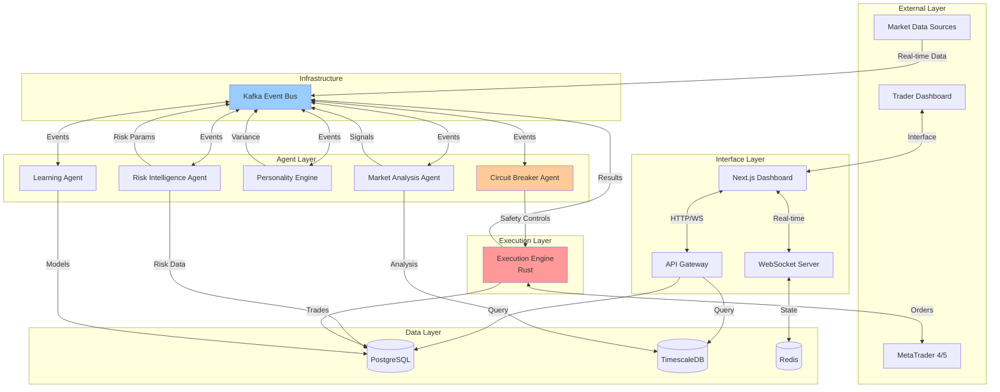

# Components

## Market Analysis Agent

**Responsibility:** Performs Wyckoff pattern detection, volume price analysis, and generates high-confidence trading signals

**Key Interfaces:**
- `/api/v1/signals/generate` - POST endpoint for signal generation
- `market.analysis.pattern_detected` - Kafka event when pattern found
- `market.analysis.signal_generated` - Kafka event for new signals
- WebSocket `/ws/analysis` - Real-time pattern updates

**Dependencies:** 
- TimescaleDB for historical market data
- Redis for real-time price streams
- Kafka for event publishing

**Technology Stack:** Python 3.11 + FastAPI + CrewAI + pandas/numpy for analysis

## Adaptive Risk Intelligence Agent (ARIA)

**Responsibility:** Dynamic position sizing, risk parameter adjustment based on account performance, volatility, and market conditions

**Key Interfaces:**
- `/api/v1/risk/calculate-position-size` - POST for position sizing
- `/api/v1/risk/update-parameters` - PUT for parameter updates  
- `risk.management.size_calculated` - Kafka event with position size
- `risk.management.parameters_updated` - Kafka event for risk changes

**Dependencies:**
- PostgreSQL for account and position data
- Redis for real-time account states
- Market Analysis Agent for volatility data

**Technology Stack:** Python 3.11 + FastAPI + CrewAI + scipy for statistical calculations

## Execution Engine

**Responsibility:** High-speed trade execution, MT4/MT5 bridge, order management, and sub-100ms latency requirements

**Key Interfaces:**
- `/api/v1/execution/place-order` - POST for order placement
- `/api/v1/execution/modify-order` - PUT for SL/TP modifications
- `execution.order.placed` - Kafka event when order executed
- `execution.order.filled` - Kafka event when order completed

**Dependencies:**
- MetaTrader 4/5 APIs via bridge
- Redis for order state caching
- Circuit Breaker Agent for safety controls

**Technology Stack:** Rust 1.75 + tokio async runtime + custom MT4/5 bridge

## Circuit Breaker Agent

**Responsibility:** Three-tier safety system (agent/account/system level), emergency stops, and risk limit enforcement

**Key Interfaces:**
- `/api/v1/breaker/status` - GET current breaker states
- `/api/v1/breaker/trigger` - POST emergency stop activation
- `breaker.agent.triggered` - Kafka event for agent-level stops
- `breaker.system.emergency` - Kafka event for system-wide halt

**Dependencies:**
- All other agents (monitors their health)
- Execution Engine (can halt trading)
- Redis for real-time state tracking

**Technology Stack:** Python 3.11 + FastAPI + asyncio for concurrent monitoring

## Personality Engine

**Responsibility:** Anti-detection through unique trading personalities, execution variance, and correlation masking

**Key Interfaces:**
- `/api/v1/personality/get-profile/{account_id}` - GET personality data
- `/api/v1/personality/apply-variance` - POST for execution variance
- `personality.variance.applied` - Kafka event with timing adjustments
- `personality.decision.override` - Kafka event for disagreements

**Dependencies:**
- Trading Account data for personality assignments
- Execution Engine for variance application
- Anti-Correlation monitoring system

**Technology Stack:** Python 3.11 + FastAPI + CrewAI + random/statistical libraries

## Learning Agent

**Responsibility:** Pattern adaptation, performance tracking, learning circuit breakers, and strategy optimization

**Key Interfaces:**
- `/api/v1/learning/update-model` - POST for model updates
- `/api/v1/learning/performance-metrics` - GET learning statistics
- `learning.model.updated` - Kafka event when model changes
- `learning.breaker.triggered` - Kafka event when learning halted

**Dependencies:**
- All trade execution data for learning
- Market Analysis Agent for pattern feedback
- Circuit Breaker for learning safety

**Technology Stack:** Python 3.11 + FastAPI + CrewAI + scikit-learn/tensorflow

## Dashboard API Gateway

**Responsibility:** Authentication, API routing, rate limiting, and WebSocket coordination for the trading dashboard

**Key Interfaces:**
- `/api/v1/auth/login` - POST authentication with 2FA
- `/api/v1/accounts` - GET/PUT account management
- `/api/v1/positions` - GET real-time position data
- WebSocket `/ws/dashboard` - Real-time updates aggregation

**Dependencies:**
- PostgreSQL for user and account data
- Redis for session management
- All agent APIs for data aggregation

**Technology Stack:** Python 3.11 + FastAPI + JWT authentication + WebSockets

## Next.js Dashboard Frontend

**Responsibility:** Web-based trading command center, multi-account monitoring, manual controls, and responsive interface

**Key Interfaces:**
- Dashboard API Gateway (REST + WebSocket client)
- Real-time chart rendering
- Emergency stop controls UI
- Account configuration interface

**Dependencies:**
- Dashboard API Gateway for all data
- WebSocket connection for real-time updates

**Technology Stack:** Next.js 14.1 + TypeScript 5.3 + TailwindCSS + React Query

## Component Diagrams

