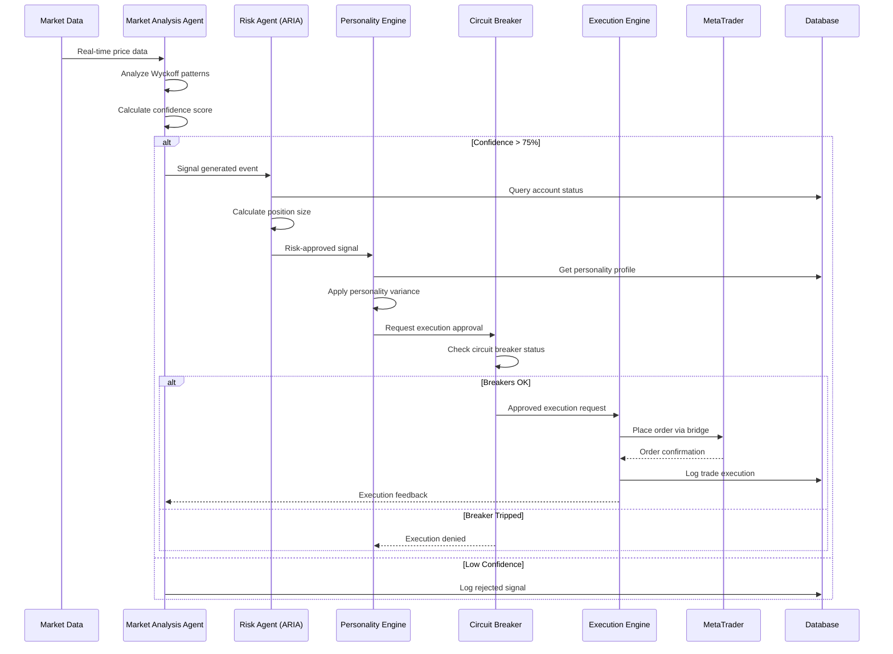
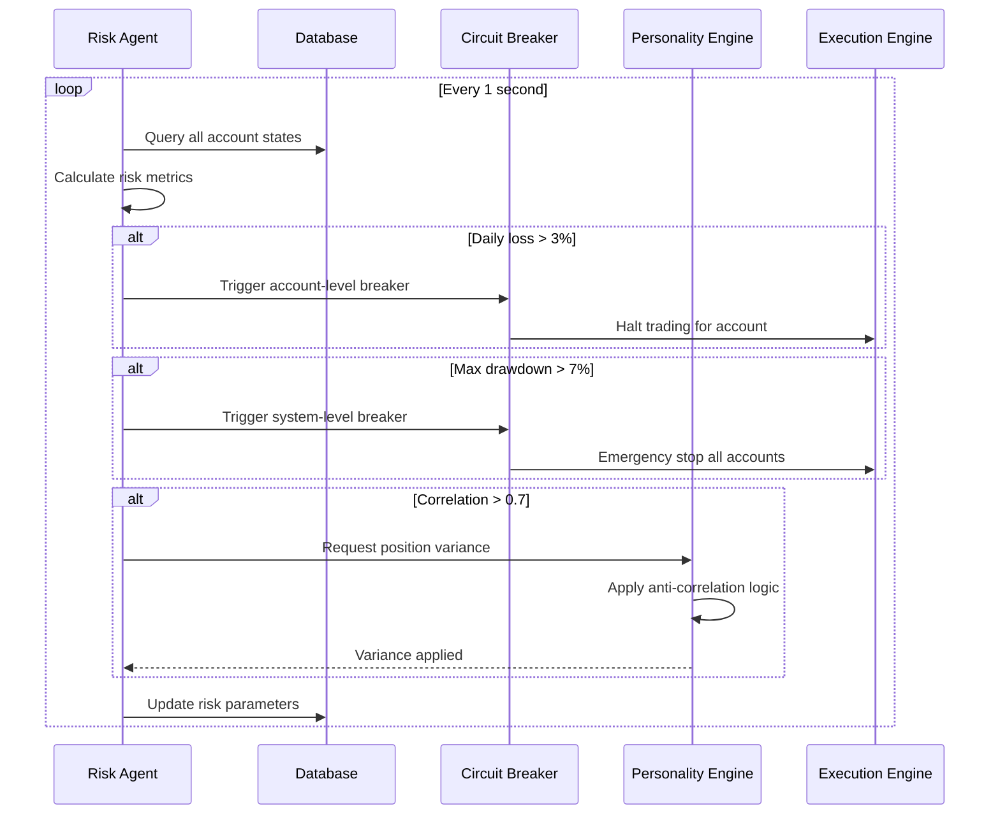

# Core Workflows

## Signal Generation and Trade Execution Workflow

```mermaid
sequenceDiagram
    participant MD as Market Data
    participant MA as Market Analysis Agent
    participant ARIA as Risk Agent (ARIA)
    participant PE as Personality Engine
    participant CB as Circuit Breaker
    participant EE as Execution Engine
    participant MT as MetaTrader
    participant DB as Database

    MD->>MA: Real-time price data
    MA->>MA: Analyze Wyckoff patterns
    MA->>MA: Calculate confidence score
    
    alt Confidence > 75%
        MA->>ARIA: Signal generated event
        ARIA->>DB: Query account status
        ARIA->>ARIA: Calculate position size
        ARIA->>PE: Risk-approved signal
        
        PE->>DB: Get personality profile
        PE->>PE: Apply personality variance
        PE->>CB: Request execution approval
        
        CB->>CB: Check circuit breaker status
        alt Breakers OK
            CB->>EE: Approved execution request
            EE->>MT: Place order via bridge
            MT-->>EE: Order confirmation
            EE->>DB: Log trade execution
            EE-->>MA: Execution feedback
        else Breaker Tripped
            CB-->>PE: Execution denied
        end
    else Low Confidence
        MA->>DB: Log rejected signal
    end
```

## Multi-Account Risk Management Workflow

```mermaid
sequenceDiagram
    participant ARIA as Risk Agent
    participant DB as Database
    participant CB as Circuit Breaker
    participant PE as Personality Engine
    participant EE as Execution Engine

    loop Every 1 second
        ARIA->>DB: Query all account states
        ARIA->>ARIA: Calculate risk metrics
        
        alt Daily loss > 3%
            ARIA->>CB: Trigger account-level breaker
            CB->>EE: Halt trading for account
        end
        
        alt Max drawdown > 7%
            ARIA->>CB: Trigger system-level breaker
            CB->>EE: Emergency stop all accounts
        end
        
        alt Correlation > 0.7
            ARIA->>PE: Request position variance
            PE->>PE: Apply anti-correlation logic
            PE-->>ARIA: Variance applied
        end
        
        ARIA->>DB: Update risk parameters
    end
```
