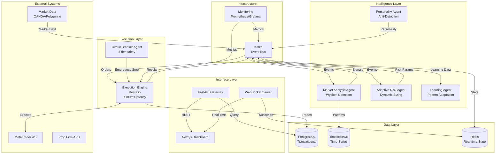

# High Level Architecture

## Technical Summary

The system employs an **event-driven microservices architecture** utilizing eight specialized AI agents orchestrated through CrewAI, with Python/FastAPI services communicating via message queues. Core components include a high-performance Rust execution engine for sub-100ms trade execution, PostgreSQL/TimescaleDB for data persistence, and a Next.js dashboard for monitoring. The architecture prioritizes fault tolerance through service isolation, implements three-tier circuit breakers for risk management, and maintains complete audit trails. This design directly supports the PRD goals of 99.8% compliance rates and 70%+ profitable months through adaptive learning while preventing detection via personality-based execution variance.

## High Level Overview

1. **Architectural Style**: Event-Driven Microservices with Agent-Based Intelligence
   - Eight specialized agents operating as independent services
   - Asynchronous communication via Kafka for resilience
   - Circuit breaker patterns preventing cascade failures

2. **Repository Structure**: Monorepo (as specified in PRD)
   - Simplified dependency management
   - Atomic commits across services
   - Shared type definitions and utilities

3. **Service Architecture**: Microservices (as specified in PRD)
   - Each agent as isolated service
   - Execution engine as separate critical service
   - Dashboard as independent frontend service

4. **Primary Data Flow**:
   - Market data → Analysis agents → Signal generation → Risk validation → Execution → Monitoring
   - Continuous feedback loop from execution results to learning agents

5. **Key Architectural Decisions**:
   - **Python for AI agents**: Mature ML ecosystem, CrewAI compatibility
   - **Rust for execution**: Guaranteed low latency for critical path
   - **Kafka over NATS**: Better durability for financial transactions
   - **TimescaleDB**: Optimized for time-series market data

## High Level Project Diagram

## Architectural and Design Patterns

- **Event-Driven Architecture:** Using Kafka for asynchronous agent communication - *Rationale:* Ensures system resilience; if one agent fails, others continue operating
- **Microservices Pattern:** Each agent as independent service with own database connection - *Rationale:* Enables independent scaling and deployment of agents
- **Circuit Breaker Pattern:** Three-tier safety system (agent/account/system level) - *Rationale:* Critical for financial safety, prevents cascade failures during market anomalies
- **Repository Pattern:** Abstract data access for all persistence operations - *Rationale:* Enables testing with mock data and future database migrations
- **CQRS (Command Query Responsibility Segregation):** Separate read/write models for trading operations - *Rationale:* Optimizes high-frequency reads without impacting write performance
- **Saga Pattern:** Distributed transactions across agents for trade execution - *Rationale:* Maintains consistency across services without distributed locks
- **Observer Pattern:** Real-time dashboard updates via WebSocket subscriptions - *Rationale:* Provides instant feedback without polling overhead
- **Strategy Pattern:** Pluggable trading strategies within agents - *Rationale:* Allows runtime strategy selection based on market conditions
- **Anti-Corruption Layer:** Between external APIs and internal domain - *Rationale:* Protects system from external API changes and inconsistencies
