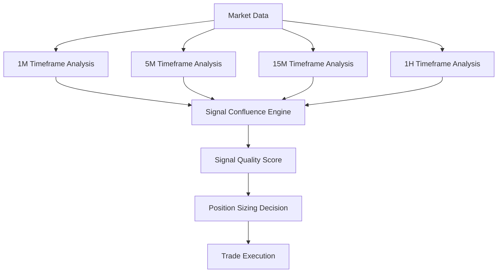

# TMT Trading System - Performance Optimization Architecture

## Introduction

This document outlines the detailed implementation plan for optimizing the performance of the Adaptive Trading System based on live trading data analysis. The system is currently operational but showing -0.60% returns, requiring strategic performance improvements.

**Current Status:**
- **Live System**: Operational with 8 AI agents trading on OANDA practice account
- **Current Performance**: -0.60% return, $99,507.08 balance
- **System Health**: All services operational, 4+ days uptime
- **Trading Activity**: 5 open positions, conservative margin usage (3.7%)

## Performance Optimization Strategy

### Phase 1: Strategy Calibration (Weeks 1-2)

#### Signal Quality Enhancement
```python
# Signal Analysis Optimization
class SignalOptimizer:
    def __init__(self):
        self.confidence_threshold = 0.70  # Increase from 65%
        self.volume_confirmation_required = True
        self.multi_timeframe_confluence = True
    
    async def optimize_signal_generation(self):
        """Optimize signal generation based on performance data"""
        # 1. Analyze 172+ signals vs 5 executions
        # 2. Identify high-quality signal patterns
        # 3. Adjust confidence thresholds
        # 4. Implement signal filtering improvements
```

#### Risk Parameter Tuning
```python
# ARIA Risk Management Optimization
class ARIARiskOptimizer:
    def __init__(self):
        self.position_size_multiplier = 1.5  # Increase from current conservative settings
        self.max_margin_usage = 0.15  # Target 15% instead of 3.7%
        self.dynamic_sizing = True
    
    async def calibrate_position_sizing(self):
        """Calibrate position sizing based on performance data"""
        # 1. Analyze current margin usage vs potential
        # 2. Implement volatility-adjusted sizing
        # 3. Add correlation-based position limits
        # 4. Enhance stop-loss placement
```

#### Exit Strategy Enhancement
```python
# Trade Exit Optimization
class ExitStrategyOptimizer:
    def __init__(self):
        self.dynamic_stops = True
        self.trailing_stop_activation = 0.5  # 50% of target
        self.profit_target_ratio = 2.0  # 2:1 risk/reward minimum
    
    async def optimize_exits(self):
        """Optimize trade exit strategies"""
        # 1. Implement trailing stops
        # 2. Add time-based exits
        # 3. Enhance profit-taking algorithms
        # 4. Improve stop-loss placement
```

### Phase 2: Performance Enhancement (Weeks 3-4)

#### Multi-Timeframe Analysis


#### Pattern Detection Refinement
```python
# Enhanced Wyckoff Pattern Detection
class WyckoffAnalyzer:
    def __init__(self):
        self.pattern_confidence_threshold = 0.75
        self.volume_analysis_depth = 20  # bars
        self.smart_money_detection = True
    
    async def analyze_wyckoff_patterns(self, market_data):
        """Enhanced Wyckoff pattern analysis"""
        # 1. Accumulation/Distribution detection
        # 2. Volume confirmation analysis
        # 3. Smart money flow detection
        # 4. Pattern strength scoring
```

### Phase 3: System Scaling Preparation (Weeks 5-6)

#### Multi-Account Architecture
```python
# Multi-Account Management System
class MultiAccountManager:
    def __init__(self):
        self.max_accounts = 10
        self.correlation_limit = 0.3
        self.personality_variance = True
    
    async def manage_accounts(self, accounts):
        """Manage multiple prop firm accounts"""
        # 1. Anti-correlation enforcement
        # 2. Account-specific personalities
        # 3. Risk distribution
        # 4. Performance tracking
```

## Component Architecture Updates

### Enhanced Market Analysis Agent

**Current State**: Basic signal generation
**Target State**: Advanced multi-timeframe analysis with ML validation

```python
# Enhanced Market Analysis Component
class EnhancedMarketAnalysis:
    """
    Responsibility: Advanced market analysis with ML-enhanced pattern recognition
    
    Key Interfaces:
    - /signals/generate - Enhanced signal generation
    - /patterns/analyze - Wyckoff pattern analysis
    - /market-state/detect - Market regime detection
    - /performance/optimize - Strategy optimization
    
    Dependencies: 
    - TimescaleDB for historical data
    - Redis for real-time caching
    - ML model inference engine
    
    Technology Stack: 
    - Python 3.11+ with FastAPI
    - scikit-learn for ML models
    - numpy/pandas for analysis
    - asyncio for concurrent processing
    """
```

### Performance Analytics Engine

**New Component**: Real-time performance analysis and optimization

```python
# Performance Analytics Component
class PerformanceAnalyticsEngine:
    """
    Responsibility: Real-time trading performance analysis and optimization
    
    Key Interfaces:
    - /performance/analyze - Real-time performance metrics
    - /optimization/suggest - Strategy optimization suggestions
    - /metrics/dashboard - Performance dashboard data
    - /alerts/configure - Performance alert configuration
    
    Dependencies:
    - Trading execution history
    - Market data feed
    - Risk management system
    
    Technology Stack:
    - Python 3.11+ with FastAPI
    - PostgreSQL for historical data
    - Redis for real-time metrics
    - asyncio for streaming analytics
    """
```

## Database Schema Enhancements

### Performance Tracking Tables

```sql
-- Trading Performance Optimization Schema
CREATE TABLE signal_performance (
    id SERIAL PRIMARY KEY,
    signal_id VARCHAR(255) NOT NULL,
    generated_at TIMESTAMP NOT NULL,
    confidence_score DECIMAL(5,4) NOT NULL,
    market_conditions JSONB,
    executed BOOLEAN DEFAULT FALSE,
    execution_delay_ms INTEGER,
    trade_id VARCHAR(255),
    outcome_pnl DECIMAL(15,2),
    created_at TIMESTAMP DEFAULT NOW()
);

CREATE TABLE strategy_metrics (
    id SERIAL PRIMARY KEY,
    strategy_name VARCHAR(100) NOT NULL,
    date DATE NOT NULL,
    total_signals INTEGER,
    executed_trades INTEGER,
    win_rate DECIMAL(5,4),
    avg_pnl_per_trade DECIMAL(15,2),
    max_drawdown DECIMAL(15,2),
    sharpe_ratio DECIMAL(8,4),
    created_at TIMESTAMP DEFAULT NOW()
);

CREATE TABLE optimization_results (
    id SERIAL PRIMARY KEY,
    optimization_type VARCHAR(50) NOT NULL,
    parameters_before JSONB,
    parameters_after JSONB,
    performance_improvement DECIMAL(8,4),
    implemented_at TIMESTAMP NOT NULL,
    rollback_threshold DECIMAL(8,4),
    status VARCHAR(20) DEFAULT 'active'
);
```

## API Specification Enhancements

### Performance Optimization Endpoints

```yaml
openapi: 3.0.0
info:
  title: TMT Performance Optimization API
  version: 2.0.0
  description: Enhanced APIs for trading performance optimization

paths:
  /performance/analyze:
    post:
      summary: Analyze trading performance
      requestBody:
        required: true
        content:
          application/json:
            schema:
              type: object
              properties:
                timeframe: 
                  type: string
                  enum: [daily, weekly, monthly]
                account_id:
                  type: string
                strategy_name:
                  type: string
      responses:
        200:
          content:
            application/json:
              schema:
                type: object
                properties:
                  performance_metrics:
                    type: object
                  optimization_suggestions:
                    type: array
                  risk_assessment:
                    type: object

  /optimization/implement:
    post:
      summary: Implement optimization suggestions
      requestBody:
        required: true
        content:
          application/json:
            schema:
              type: object
              properties:
                optimization_id:
                  type: string
                parameters:
                  type: object
                rollback_threshold:
                  type: number
```

## Implementation Workflow

### Week 1-2: Strategy Calibration
```bash
# Implementation Steps
cd agents/market-analysis
python optimize_signal_generation.py --analyze-historical
python calibrate_confidence_thresholds.py --target-win-rate=0.60
python enhance_pattern_detection.py --add-volume-confirmation

cd agents/parameter-optimization  
python optimize_aria_risk_params.py --increase-position-sizing
python calibrate_exit_strategies.py --implement-trailing-stops
```

### Week 3-4: Performance Enhancement
```bash
# Enhanced Analytics Implementation
cd agents/continuous-improvement
python deploy_performance_analytics.py --enable-real-time
python implement_multi_timeframe_analysis.py
python enhance_ml_pattern_validation.py

# Dashboard Updates
cd dashboard
npm run add-performance-widgets
npm run implement-real-time-metrics
```

### Week 5-6: Scaling Preparation
```bash
# Multi-Account Preparation
cd orchestrator
python implement_multi_account_support.py
python deploy_anti_correlation_engine.py
python test_account_isolation.py

# Platform Expansion
cd agents/compliance
python add_prop_firm_integrations.py --firms=FTMO,MyForexFunds
python validate_compliance_engines.py
```

## Success Metrics & Monitoring

### Target Performance Metrics
| Metric | Current | Target (30 days) | Target (60 days) |
|--------|---------|------------------|------------------|
| **Monthly Return** | -0.60% | +2-3% | +3-5% |
| **Sharpe Ratio** | N/A | >1.0 | >1.5 |
| **Max Drawdown** | -0.60% | <3% | <5% |
| **Win Rate** | N/A | >55% | >60% |
| **Signal Execution Ratio** | 3% (5/172) | >15% | >25% |

### Real-Time Monitoring Dashboard
```typescript
// Performance Monitoring Component
interface PerformanceMetrics {
  currentReturn: number;
  sharpRatio: number;
  maxDrawdown: number;
  winRate: number;
  signalExecutionRatio: number;
  riskMetrics: RiskMetrics;
}

interface OptimizationStatus {
  activeOptimizations: Optimization[];
  performanceImpact: number;
  rollbackConditions: RollbackCondition[];
}
```

## Risk Management & Safety

### Enhanced Circuit Breakers
```python
# Performance-Based Circuit Breakers
class PerformanceCircuitBreaker:
    def __init__(self):
        self.max_daily_loss = 0.02  # 2% max daily loss
        self.max_drawdown = 0.05    # 5% max drawdown
        self.min_win_rate = 0.40    # 40% minimum win rate
        self.signal_quality_threshold = 0.65
    
    async def monitor_performance(self):
        """Monitor performance and trigger circuit breakers"""
        # 1. Real-time P&L monitoring
        # 2. Win rate tracking
        # 3. Signal quality assessment
        # 4. Automatic position closure if thresholds breached
```

## Testing Strategy

### Performance Optimization Testing
```python
# Backtesting Framework for Optimizations
class OptimizationBacktester:
    def __init__(self):
        self.historical_data_months = 6
        self.walk_forward_windows = 30  # days
        self.monte_carlo_simulations = 1000
    
    async def validate_optimization(self, strategy_params):
        """Validate optimization before live deployment"""
        # 1. Historical backtesting
        # 2. Walk-forward analysis
        # 3. Monte Carlo simulation
        # 4. Risk-adjusted return calculation
```

## Deployment Strategy

### Gradual Rollout Approach
```python
# Gradual Optimization Deployment
class OptimizationDeployment:
    def __init__(self):
        self.rollout_percentage = 0.20  # Start with 20% allocation
        self.performance_monitoring_window = 7  # days
        self.rollback_trigger = -0.02  # 2% performance degradation
    
    async def deploy_optimization(self, optimization):
        """Deploy optimization with gradual rollout"""
        # 1. Deploy to 20% of trading capital
        # 2. Monitor performance for 7 days
        # 3. Increase allocation if successful
        # 4. Rollback if performance degrades
```

## Next Steps

### Immediate Actions (This Week)
1. **Signal Analysis**: Deep dive into 172 signals vs 5 executions
2. **Risk Calibration**: Increase position sizing within safe limits
3. **Performance Monitoring**: Implement real-time analytics

### Medium-term Goals (Month 1)
1. **Strategy Optimization**: Achieve positive monthly returns
2. **Enhanced Analytics**: Deploy comprehensive performance tracking
3. **Multi-timeframe Analysis**: Implement confluence-based trading

### Long-term Objectives (Month 2)
1. **Multi-Account Scaling**: Test with multiple prop firm accounts
2. **Platform Expansion**: Add additional prop firm integrations
3. **Advanced ML**: Deploy machine learning pattern validation

---

**Implementation Priority**: **Strategy Calibration → Performance Enhancement → Scaling Preparation**

**Success Criteria**: Positive monthly returns within 30 days, ready for multi-account deployment within 60 days.